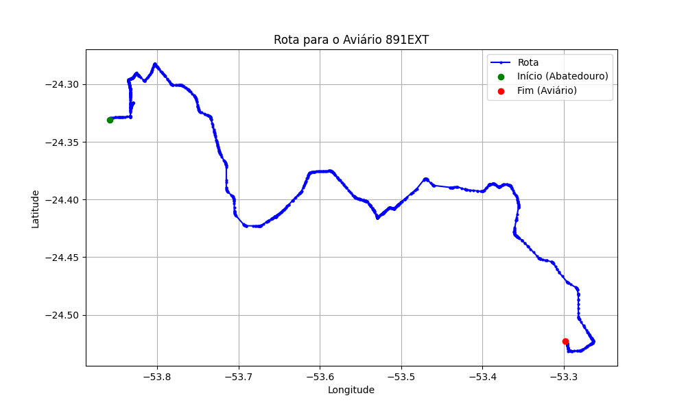

# Relatório de Rota - Aviário 891EXT

## Informações Gerais
- **Produtor:** COPACOL CEZAR EXTEKOETTER E OUTRA 01
- **Latitude:** -24.523493
- **Longitude:** -53.298354

## Dados da Rota
- **Distância Real:** 97.08 km
- **Tempo Estimado (OSRM):** 98.5 minutos
- **Tempo Estimado (40 km/h):** 145.6 minutos

## Mapa da Rota

[Visualizar Mapa Interativo](mapa_interativo.html)

## Rota até o aviário
1. Saia da rua sem nome, siga por 10m.
2. Vire à direita na Avenida Ariosvaldo Bitencourt, siga por 200m.
3. Siga em frente na Avenida Ariosvaldo Bitencourt, siga por 2,5 km.
4. Vire à esquerda na rua sem nome, siga por 1,5 km.
5. Vire levemente à esquerda na rua sem nome, siga por 660m.
6. Vire em frente na Rodovia Alberto Dalcanale, siga por 1,7 km.
7. New name em frente na Avenida Presidente Kennedy, siga por 960m.
8. Vire à direita na Rua Juscelino Kubitscheck, siga por 1,3 km.
9. Vire à direita na Rua Madre Teresa de Calcutá, siga por 440m.
10. New name em frente na rua sem nome, siga por 880m.
11. Vire à esquerda na rua sem nome, siga por 2,1 km.
12. Vire levemente à direita na Rodovia Deputado Edilson Alencar, siga por 24,6 km.
13. New name em frente na Avenida Sudoeste, siga por 490m.
14. End of road à direita na Avenida Praça São Roque, siga por 210m.
15. Vire à direita na Avenida Nordeste, siga por 540m.
16. New name em frente na Rodovia Deputado Edilson Alencar, siga por 14,7 km.
17. Vire à direita na rua sem nome, siga por 190m.
18. Vire em frente na Avenida Londrina, siga por 710m.
19. Vire à esquerda na rua sem nome, siga por 60m.
20. New name levemente à esquerda na rua sem nome, siga por 1,8 km.
21. Fork levemente à direita na Avenida Dom Pedro II, siga por 510m.
22. Siga em frente na Avenida Dom Pedro II, siga por 36,2 km.
23. Vire levemente à direita na rua sem nome, siga por 60m.
24. New name em frente na Rua Jaime Canet Junior, siga por 220m.
25. Exit roundabout levemente à direita na Avenida São Paulo, siga por 3,4 km.
26. Vire à direita na rua sem nome, siga por 1,1 km.
27. Você chegará ao aviário 891EXT à esquerda.
