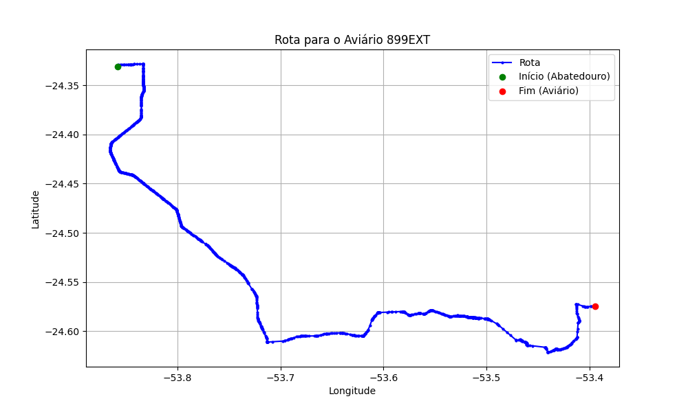

# Relatório de Rota - Aviário 899EXT

## Informações Gerais
- **Produtor:** COPACOL ARLINDO PEZENTI 2707
- **Latitude:** -24.573219
- **Longitude:** -53.394427

## Dados da Rota
- **Distância Real:** 82.79 km
- **Tempo Estimado (OSRM):** 90.4 minutos
- **Tempo Estimado (40 km/h):** 124.2 minutos

## Mapa da Rota

[Visualizar Mapa Interativo](mapa_interativo.html)

## Rota até o aviário
1. Saia da rua sem nome, siga por 10m.
2. Vire à direita na Avenida Ariosvaldo Bitencourt, siga por 200m.
3. Siga em frente na Avenida Ariosvaldo Bitencourt, siga por 2,6 km.
4. Vire em frente na Rodovia Alberto Dalcanale, siga por 38,7 km.
5. Vire levemente à esquerda na rua sem nome, siga por 130m.
6. Vire à esquerda na rua sem nome, siga por 9,6 km.
7. Fork levemente à esquerda na rua sem nome, siga por 3,0 km.
8. Vire em frente na rua sem nome, siga por 140m.
9. Fork levemente à direita na rua sem nome, siga por 60m.
10. New name em frente na PR-581, siga por 9,2 km.
11. Vire à direita na Praça Liberdade, siga por 290m.
12. Vire levemente à esquerda na Praça Santos dumont, siga por 90m.
13. Vire à direita na Avenida Presidente Castelo Branco, siga por 180m.
14. End of road à direita na Praça da Independência, siga por 130m.
15. Vire à direita na Avenida Presidente Castelo Branco, siga por 180m.
16. End of road à direita na Praça dos Espedicionários, siga por 330m.
17. Vire levemente à esquerda na Praça do Triunfo, siga por 80m.
18. Vire à direita na Rua 24 de Julho, siga por 900m.
19. Vire em frente na PR-581, siga por 3,7 km.
20. Vire à esquerda na rua sem nome, siga por 430m.
21. Vire à direita na rua sem nome, siga por 760m.
22. Vire levemente à direita na rua sem nome, siga por 230m.
23. Vire à esquerda na rua sem nome, siga por 2,5 km.
24. End of road à esquerda na rua sem nome, siga por 3,6 km.
25. Vire à esquerda na rua sem nome, siga por 3,8 km.
26. Vire à direita na rua sem nome, siga por 1,9 km.
27. Você chegará ao aviário 899EXT à esquerda.
